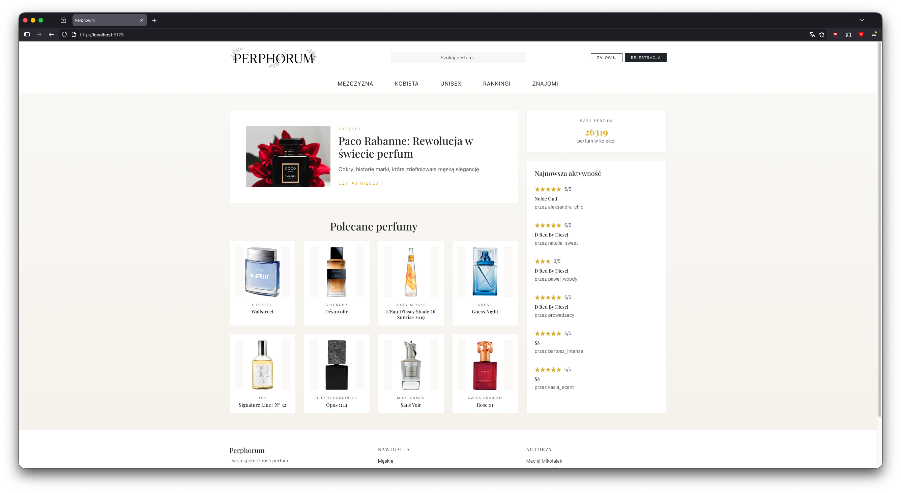
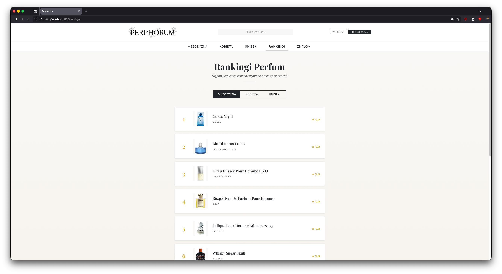
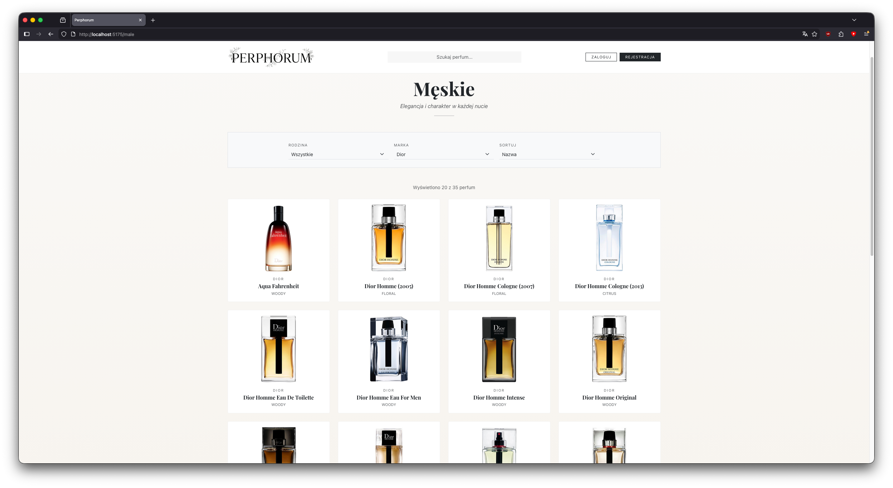
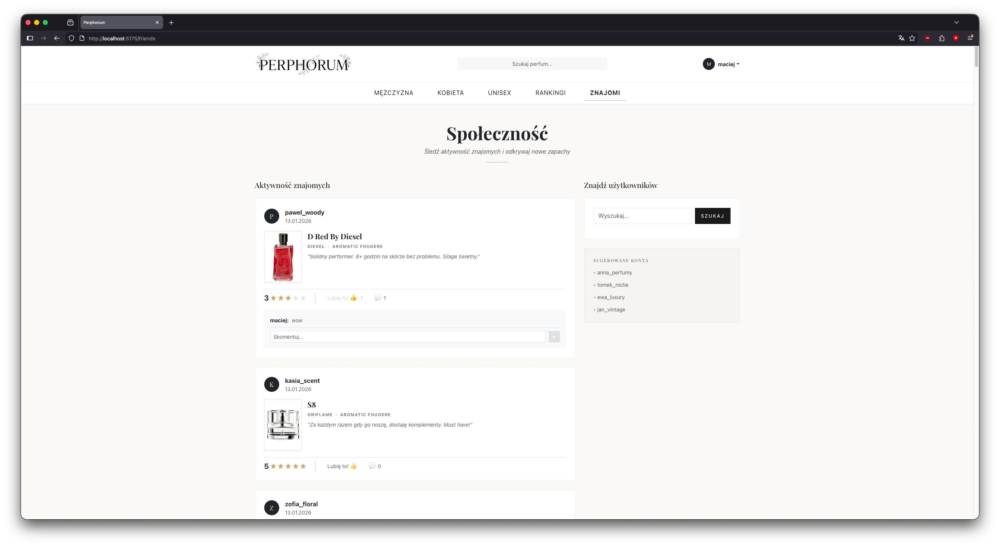

# Perphorum - Dokumentacja Systemu

Projekt implementujący portal społecznościowy dla pasjonatów perfum, inspirowany serwisami takimi jak **Filmweb** oraz **Fragrantica**. Aplikacja umożliwia przeglądanie bazy zapachów, ich recenzowanie, tworzenie własnych kolekcji oraz interakcję z innymi użytkownikami.

---

## 👥 Autorzy
*   **Maciej Mikołajek** - [GitHub](https://github.com/maciusk8)
*   **Mateusz Wróbel** - [GitHub](https://github.com/mateuszwroobel)

---

## Architektura Systemu

System został zrealizowany w architekturze **Client-Server** (Single Page Application + REST API). Codebase podzielony jest na dwie niezależne części: `frontend` (React) oraz `backend` (Spring Boot, Java 25).

### Stos Technologiczny

#### Frontend (Warstwa Prezentacji)
*   **React 18**: Biblioteka UI (budowa oparta o Functional Components i Hooks).
*   **TypeScript**: Zapewnia typowanie statyczne i bezpieczeństwo kodu.
*   **React Router**: Odpowiada za routing po stronie klienta (SPA).
*   **React Bootstrap**: System komponentów UI stylizowany na potrzeby estetyki "Premium" (złocenia, szeryfowe czcionki).
*   **Vite**: Build tool zapewniający szybki development.

#### Backend (Warstwa Logiki Biznesowej)
*   **Spring Boot 3**: Framework aplikacyjny (REST API, Dependency Injection).
*   **Spring Security**: Bezpieczeństwo i autentykacja (Stateless).
*   **JJWT (Java JSON Web Token)**: Implementacja standardu JWT do generowania i walidacji tokenów.
*   **Spring Data JPA (Hibernate)**: Warstwa dostępu do danych (ORM).
*   **H2 Database**: Baza in-memory (dla łatwej demonstracji i testów), skonfigurowana do seedowania danymi startowymi.
*   **Lombok**: Biblioteka redukująca boilerplate code (automatyczne gettery, settery, buildery).
*   **Jackson**: Serializacja i deserializacja danych do formatu JSON.

---

## Realizacja Funkcjonalności (Wymagania)

Poniższa tabela przedstawia, w jaki sposób zrealizowano kluczowe funkcjonalności wymagane dla nowoczesnego portalu społecznościowego o tej tematyce.

| Moduł | Opis Implementacji |
| :--- | :--- |
| **Katalog Perfum** | Baza danych zawierająca szczegółowe informacje: Marka, Nazwa, Rodzina Zapachowa, Nuty, Opis, Zdjęcie. Zaawansowane filtrowanie po płci, marce i składnikach. |
| **System Ocen** | Użytkownicy mogą oceniać perfumy (1-5 gwiazdek). System automatycznie wylicza średnią ocenę. |
| **Recenzje i Dyskusje** | Możliwość dodawania rozbudowanych recenzji tekstowych. Inni użytkownicy mogą je komentować i lajkować. |
| **Profile Użytkowników** | Każdy użytkownik posiada publiczny profil prezentujący jego aktywność. |
| **Wirtualne Półki** | Funkcjonalność "Posiadam" (Kolekcja) oraz "Chcę mieć" (Wishlist), widoczna na profilu użytkownika. |
| **Społeczność** | System znajomych. Feed aktywności (`FriendsPage`) agregujący recenzje znajomych. |
| **Rankingi** | Dynamicznie generowana lista "Top Perfumy" sortowana według średniej ocen. |
| **Bezpieczeństwo** | Rejestracja, logowanie (JWT/BCrypt), ochrona routingu (User/Admin), zabezpieczenie przed atakami (np. XSS, infinite recursion w JSON). |
| **Monetyzacja** | Serwis umożliwia komercjalizację dzięki artykułom sponsorowanym wyświetlanym na stronie głównej (Hero Section). |


---

## Galeria

### Strona Główna


### Ranking Perfum


### Szczegóły Perfum


### Katalog (Męskie)


### Feed Aktywności


### Profil Użytkownika


---

## Model Danych i Baza

Aplikacja wykorzystuje relacyjny model danych. Kluczowe encje:

*   **`AppUser`**: Użytkownik, jego rola (USER/ADMIN), hasło (hash) oraz relacje społecznościowe.
*   **`Perfume`**: Produkt, zawiera metadane (marka, rodzina, nuty) oraz relację do recenzji.
*   **`Review`**: Opinia użytkownika łącząca `AppUser` z `Perfume`.
*   **`Comment`**: Komentarz pod recenzją.


**Seedowanie danych**:
Podczas startu backendu, klasa `DataLoader.java` sprawdza stan bazy. Jeśli jest pusta (lub prawie pusta), automatycznie ładuje kilkaset rekordów perfum z pliku `perfumes.json` oraz tworzy przykładowych użytkowników i recenzje, aby system "żył" od pierwszego uruchomienia.

*Dane perfum pochodzą ze zbioru: [HuggingFace - Perfume Dataset](https://huggingface.co/datasets/doevent/perfume/tree/main?not-for-all-audiences=true).*

---

## Uruchomienie Projektu

Projekt składa się z dwóch niezależnych serwerów, które muszą działać jednocześnie:

*   **Backend (Spring Boot)**: Działa na porcie `8080`.
*   **Frontend (Vite/React)**: Działa na porcie `5175`.

---

## Konta Testowe

Dla ułatwienia weryfikacji przygotowano gotowe konta testowe z przypisanymi rolami. Znajdują się one również w tabelce na stronie logowania.

| Login | Hasło | Rola | Opis |
| :--- | :--- | :--- | :--- |
| **maciej** | `maciej123` | USER | Zwykły użytkownik z historią recenzji. |
| **mateusz** | `mateusz123` | USER | Zwykły użytkownik. |
| **prowadzacy** | `admin123` | **ADMIN** | Konto z uprawnieniami do usuwania treści. |

---

## Dokumentacja API

Cała komunikacja z backendem odbywa się poprzez REST API z prefiksem `/api/`.

### AuthController (`/api/auth`)
*Zarządzanie sesją i kontami użytkowników*

| Metoda | Endpoint | Parametry (Body) | Opis |
| :--- | :--- | :--- | :--- |
| **POST** | `/register` | `{ username, email, password }` | Rejestracja nowego użytkownika. Zwraca token JWT w przypadku sukcesu. |
| **POST** | `/login` | `{ username, password }` | Logowanie. Zwraca obiekt `AuthResponse` zawierający token JWT, rolę i ID. |

### PerfumeController (`/api/perfumes`)
*Przeglądanie katalogu perfum*

| Metoda | Endpoint | Parametry (Query/Path) | Opis |
| :--- | :--- | :--- | :--- |
| **GET** | `/` | - | Pobiera listę wszystkich perfum. |
| **GET** | `/search` | `?text={query}` | Wyszukiwanie perfum po nazwie (case-insensitive). |
| **GET** | `/{id}` | `id` (Path) | Szczegółowe dane konkretnego zapachu. |
| **GET** | `/brand/{brandName}` | `brandName` (Path) | Lista perfum danej marki. |
| **GET** | `/gender/{gender}` | `gender` (Path) | Filtrowanie po płci (`Male`, `Female`, `Unisex`). |
| **GET** | `/ingredient` | `?name={query}` | Wyszukiwanie perfum zawierających dany składnik. |

### ReviewController (`/api/reviews`)
*System recenzji i ocen*

| Metoda | Endpoint | Parametry | Opis |
| :--- | :--- | :--- | :--- |
| **POST** | `/` | `{ userId, perfumeId, text, rating }` | Dodanie nowej recenzji (dozwolona jedna na produkt od użytkownika). |
| **GET** | `/perfume/{id}` | `id` (Path) | Wszystkie recenzje dla danych perfum. |
| **GET** | `/user/{id}` | `id` (Path) | Wszystkie recenzje napisane przez konkretnego użytkownika. |
| **GET** | `/recent` | `?limit=6` | Ostatnio dodane recenzje (dla strony głównej). |
| **GET** | `/feed` | `?userId={id}` | Feed aktywności znajomych danego użytkownika. |
| **POST** | `/{id}/like` | `?userId={id}` | Toggle like (polubienie/odlubienie) recenzji. |
| **DELETE** | `/{id}` | `id` (Path) | Usunięcie recenzji (Wymaga uprawnień). |

### CommentController (`/api/comments`)
*Komentowanie recenzji*

| Metoda | Endpoint | Parametry | Opis |
| :--- | :--- | :--- | :--- |
| **POST** | `/` | `{ userId, reviewId, text }` | Dodanie komentarza pod recenzją. |
| **DELETE** | `/{id}` | `id` (Path) | Usunięcie komentarza. |

### AppUserController (`/api/users`)
*Profil społecznościowy i listy*

| Metoda | Endpoint | Parametry | Opis |
| :--- | :--- | :--- | :--- |
| **GET** | `/{id}` | `id` (Path) | Pobiera dane publiczne profilu (nazwa, ID). |
| **GET** | `/search` | `?query={username}` | Wyszukiwanie użytkowników po nazwie. |
| **GET** | `/{id}/wishlist` | `id` (Path) | Pobiera listę perfum "Chcę mieć". |
| **GET** | `/{id}/owned` | `id` (Path) | Pobiera listę perfum "Posiadam". |
| **POST** | `/wishlist` | `?userId=X&perfumeId=Y` | Dodaj/Usuń z wishlisty (Toggle). |
| **POST** | `/owned` | `?userId=X&perfumeId=Y` | Dodaj/Usuń z kolekcji (Toggle). |
| **GET** | `/{id}/friends` | `id` (Path) | Lista znajomych użytkownika. |
| **POST** | `/friend` | `?myId=X&targetId=Y` | Dodaj/Usuń użytkownika ze znajomych (Toggle). |

---

## Struktura Folderów

```
perphorum/
├── backend/perphorum/          # Aplikacja Spring Boot
│   ├── src/main/java/...       # Kontrolery, Model, Serwisy
│   └── src/main/resources/...  # Konfiguracja, perfumes.json
├── frontend/                   # Aplikacja React
│   ├── src/
│   │   ├── components/         # Komponenty wielokrotnego użytku
│   │   ├── pages/              # Widoki (Auth, Gender, Brand)
│   │   ├── services/           # Komunikacja z API
│   │   ├── context/            # Context API (Auth)
│   │   └── [FeaturePages]/     # Moduły stron (Home, Profile, Product...)
│   └── package.json
├── screenshots/                # Zrzuty ekranu do dokumentacji
└── README.md                   # Ten dokument
```
